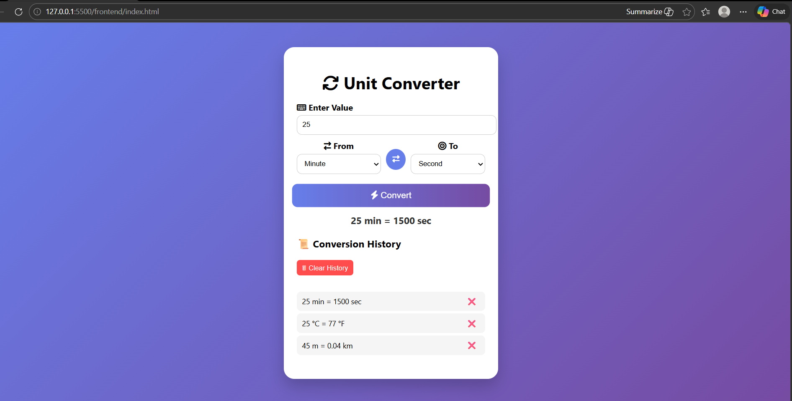

🚀 Unit Converter App
A smart and simple unit converter built using **Flask (backend)** and **JavaScript (frontend)**.

✨ Features
- Convert length, weight, temperature
- Fast and user-friendly UI
- Full-stack project (Frontend + Backend)

🛠️ Technologies Used
- Python (Flask)
- HTML, CSS, JavaScript

 📁 Project Structure
- backend/ → Flask backend
- frontend/ → UI files

⚙️ How to Run
1. Clone the repo
2. Go to backend folder
3. Run: `python app.py`
4. Open browser at http://127.0.0.1:5000

📸 Screenshot

 
